# Wallet App 
Made by Hi5 Team 
  

> Wallet App is a web-based application that allows users to manage their finances, monitor transactions and track account balances. The app is designed for personal use and provides tools for tracking income and expenses.

## Table of Contents
* [General Info](#general-information)
* [Site](#site)
* [Technologies Used](#technologies-used)
* [Features](#features)
* [Setup](#setup)
* [Project Status](#project-status)
* [Acknowledgements](#acknowledgements)
* [Contact](#contact)

---
# Site 
## Version for Mobile / Tablet / Desktop - Responsive Web Design (RWD)
#
## Mobile
### Login and Register Pages 
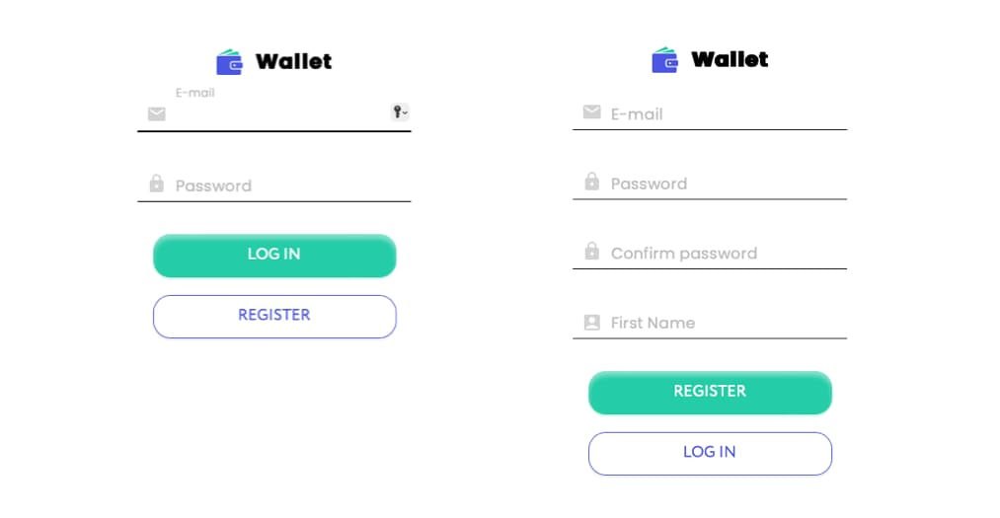
### Balance and Currency Pages
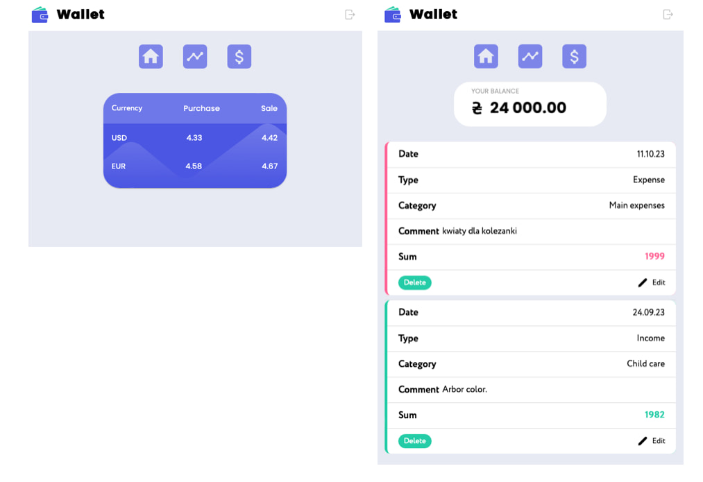

### Add Transaction Pages 
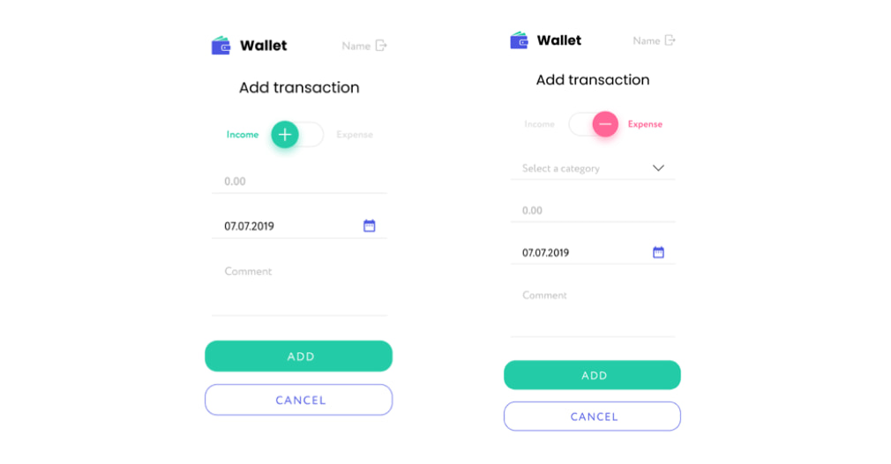

### Edit Transaction Page 
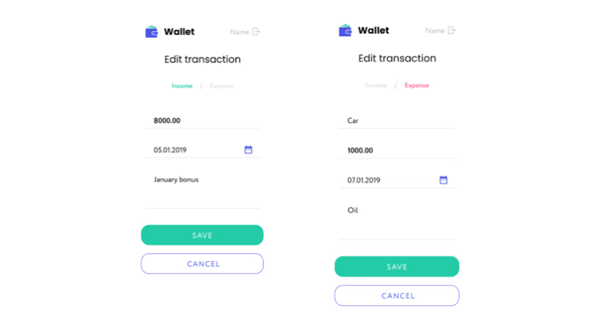

### Statistics
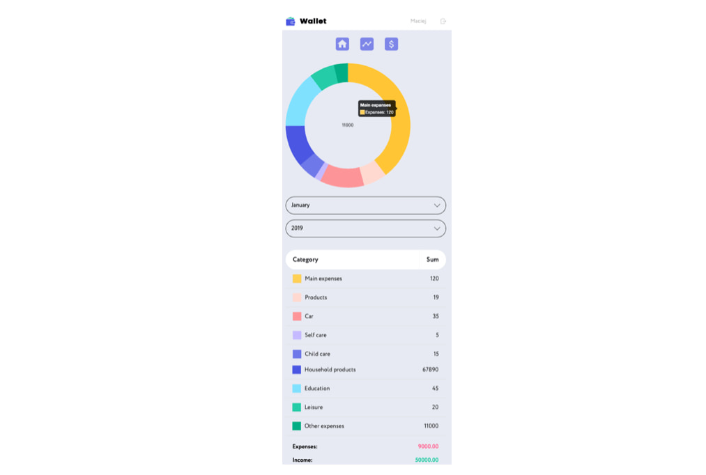

### Logout Page
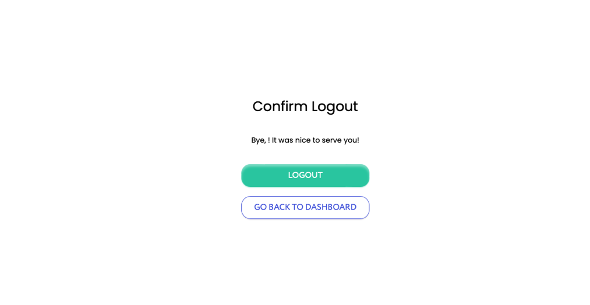

---

## Tablet
### Login and Register Pages
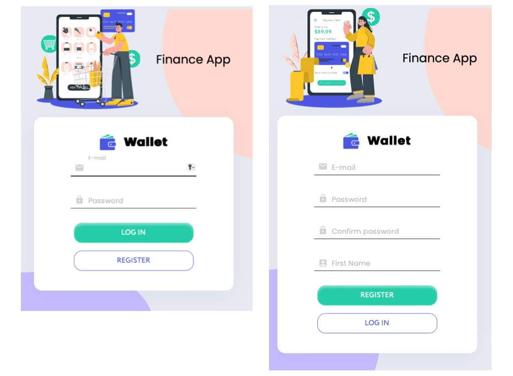

---

### Balance, Currency and Statistic

---

### Add Transaction Page 

---

### Edit Transaction Page

---

### User Panel
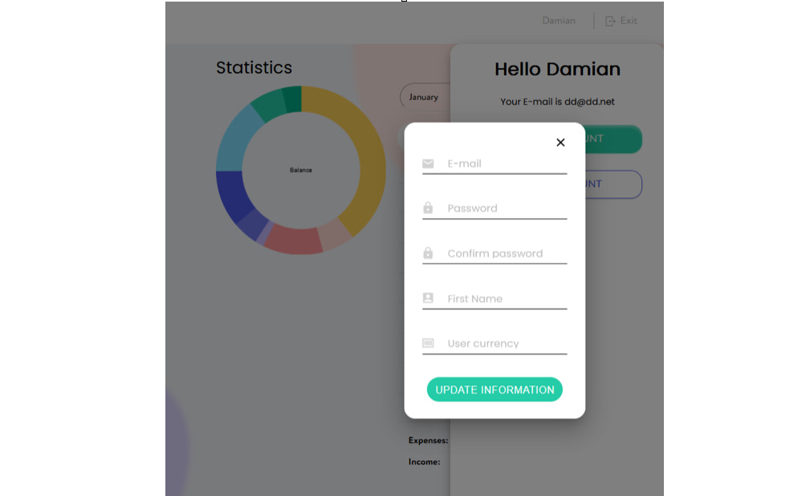
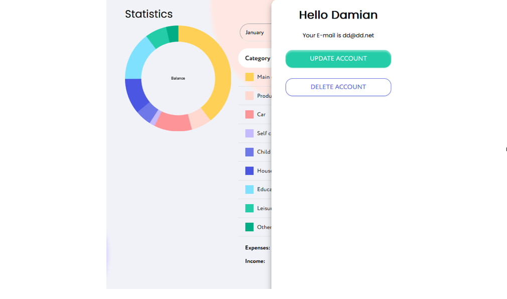
---

## Desktop

---

### Register Page 
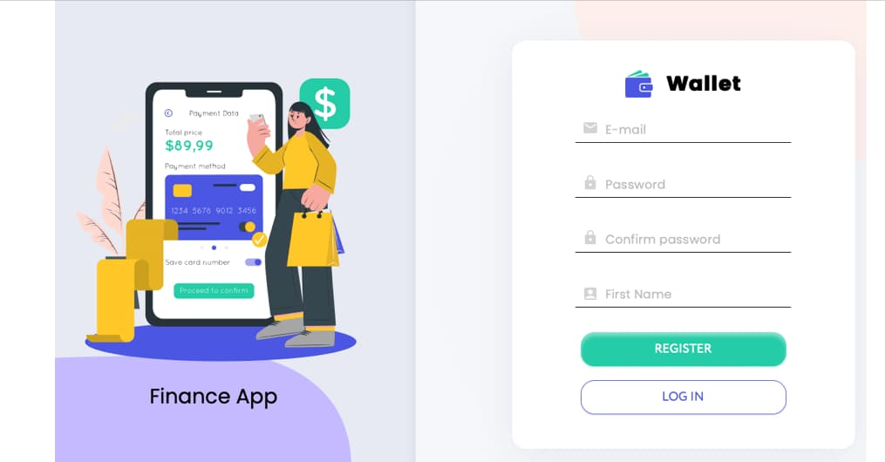
---

### Login Page
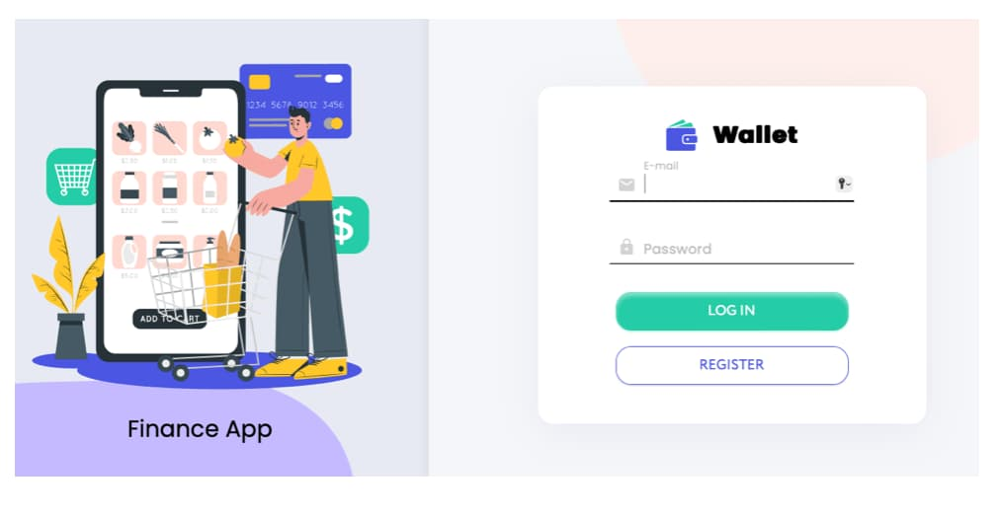
---

### Balance, Curency and Statistic 
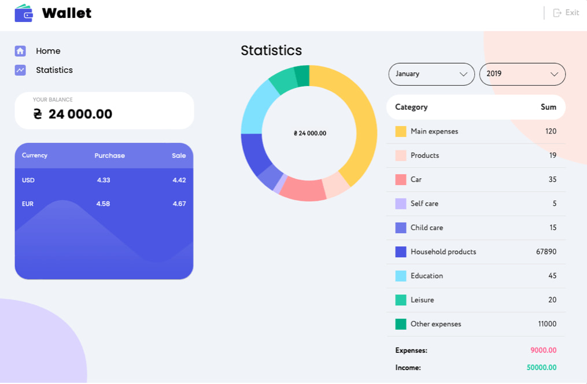
---

### Add Transaction Page 

---

### Edit Transaction Page 

--- 

### Logout Page
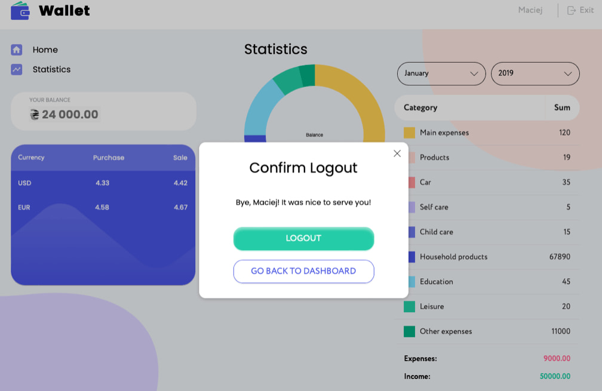

---

## General Information
- The Wallet application created is the final task to take advantage of all the areas faced during the full year of fullstack learning

---

## Technologies Used
### Overall:
- VSCode (with bash terminal)
- JavaScript ES6
- Vite (JavaScript + SWC)
- GitHub
- GIT
- prettier
- Slack
- Trello
- Figma
- Squoosh: For image optimization and compression.
- IcoMoon.io: For creating and managing custom icon fonts.
- .env / dotenv
- Node.js (v18.17.1):
- npm (9.8.0) - package manager
- faker - generate mock transactions

### Frontend (client side):
- Deployed on GitHub Pages
- HTML5, CSS3
- Modern-normalize
- React.js: JavaScript framework for building the user interface.
- React Hooks
- React-Media: For adapting the interface to different screen resolutions.
- Redux: Library for managing the state of the application.
- React-password-strength-bar - shows password strength.
- Redux-Persist: For storing the state of the application, including the token in localStorage.
- LocalStorage: For storing certain data on the client side, such as tokens.
- React Router: For navigating between different views of the application.
- Material-UI: For building user interfaces and components.
- Formik and Yup: For handling forms and validation.
- Notiflix: For displaying error notifications and other messages to the user.
- Chart.js and react-chartjs-2: For charts and data visualization.
- React-Loader-Spinner: For displaying the loading indicator (spinner).
- Axios: For making HTTP requests to the server.
- react-password-strength-bar: Library for password strength indication.
- Datetime: Library for date and time input.
- api.nbp.pl - getting currency data

Backend (server side):
- Deployed on https://render.com
- Node.js (v18.17.1): The runtime environment for the server.
- Nodemon
- Express.js: Framework for creating an HTTP server.
- MongoDB: NoSQL database, perhaps using mongoose as the database interaction tool.
- Mongoose
- CORS, CORS-env
- Morgan
- JWT (JSON Web Tokens): For user authentication.
- joi - validation
- Bcript - encrypting
- Passport, passport-jwt
- SendGrid - email delivery API
- Swagger UI: For generating API endpoint documentation.
- colors - add colors in terminal

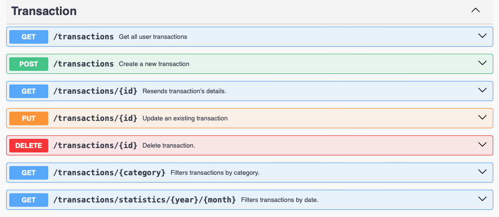
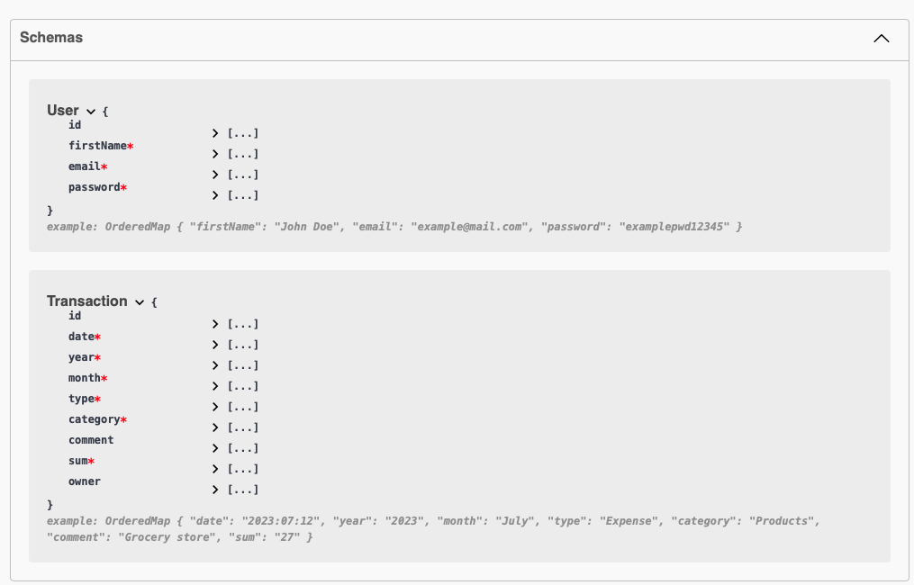

---
## Features
List the ready features here:
- Users registration, email verification and login:
- The application handles the registration, sending email with verification link and login process for users. - It uses the Formik and Yup (or Indicative) library to validate form fields, including checking the validity of email address and password length.
- User auth Management: After a successful user login, the user's token and credentials are stored in the Redux Store, and the isAuth flag is set to true. In case of a login error, the error is stored in the session state and displayed to the user.
- Routing Protection: Higher-Order Components (HOCs) such as withAuthRedirect are used, which control access to specific sites based on the user's authentication status. In this way, routing protection is provided.
- Data Retrieval: The application retrieves transaction and balance status data. These operations are performed when the DashboardPage component is loaded and are asynchronous.
- Displaying Data on Charts: The Chart component uses the react-chartjs-2 library to display data on charts. This data is likely to come from the user's transactions and can be presented as charts.
- Adding Transactions: The app allows you to add new transactions using a form that appears when you click the "Add Transaction" button. Values such as date, sum, transaction type and comment are validated before being sent to the server.
- Transaction Categories: There is an endpoint for obtaining transaction categories, which suggests that transactions can be grouped by category.
- Transaction Statistics: There is an endpoint for obtaining detailed statistics for the month and year with user transactions. This allows you to generate reports and analyze expenses.
- Modal Logout: When the user clicks on the "Logout" button, a modal window appears to confirm the logout. This is an extra layer of security to avoid accidental logout.
- Loader (Spinner): A spinner is used to indicate activity during asynchronous operations, such as downloading data. This spinner is called in the center of the screen.
- Balance Display: The Balance component subscribes to the total balance data and displays it.
- Dynamic Navigation: Navigation between different sections of the app is handled by react-router-dom navigation. Users can navigate between pages, such as "Home" and "Diagram," via the Navigation component.
- Filtering Transactions: The app provides the ability to filter and view transactions to help users keep track of their finances.
- Performance Optimization: There is a suggestion about saving the response with the date of the last request in localStorage and reusing this data for a period of an hour to reduce server load.
- Fonts and Favicon: The app manages fonts and favicon, which affects the look and style of the user interface.
- API documentation: There is a plan to create API endpoint documentation with Swagger UI Express, making it easier to understand and test the API.

---

# Setup
## For Developers:
---
## Install all packages included in package.json: npm install

### To run front-end App: npm run dev
### To run back-end server.js: npm run start:dev
---
### Node version: v18.17.1
### npm version: 9.8.0

---

Deploying Vite App to GitHub Pages using gh-pages and script deploy:

Install gh-pages: npm install gh-pages --save-dev

Use script in package.json:
( "deploy": "npm run build && gh-pages -d dist" )

Run script to build and publish in gh-pages branch on GitHub: 
npm run deploy

---

## Project status
The project has been completed, but there is always space to improve it.
Give as the feedback on: wallet.app.hi5@gmail.com

---

## Acknowledgements
- This project as mentioned is the concluding phase of the training - Thanks to Team 5 and GoIT

- [npm](https://www.npmjs.com/package/zod#introduction): Package manager.
- [React](https://reactjs.org/): JavaScript library for building user interfaces.
- [Node.js](https://nodejs.org/): JavaScript runtime environment for server-side development.
- [MongoDB](https://www.mongodb.com/): NoSQL database for storing data.
- [Express.js](https://expressjs.com/): Web framework for Node.js.
- [JWT](https://jwt.io/): JSON Web Tokens for user authentication.
- [Material-UI](https://material-ui.com/): UI framework for React applications.
- [Chart.js](https://www.chartjs.org/): JavaScript library for creating charts.
- [Formik](https://formik.org/): Form library for React applications.
- [Yup](https://github.com/jquense/yup): JavaScript schema validation library.
- [React Router](https://reactrouter.com/): Routing library for React applications.
- [Swagger UI](https://swagger.io/tools/swagger-ui/): Tool for generating API documentation.
- [Notiflix](https://github.com/notiflix/Notiflix): Library for displaying notifications.
- [Axios](https://axios-http.com/): HTTP client for making requests.
- [Squoosh](https://squoosh.app/): Image optimization and compression tool.
- [IcoMoon.io](https://icomoon.io/): Custom icon font generator.

---

## Contact
Created by Hi5 Team - feel free to contact us!
e-mail: wallet.app.hi5@gmail.com
# 
 