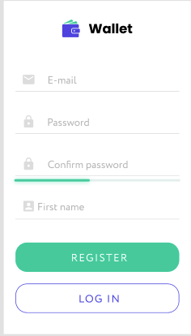
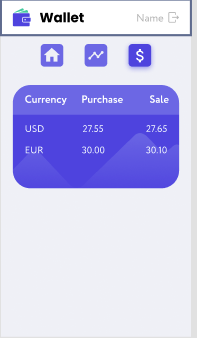
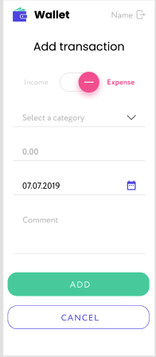
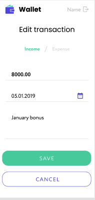
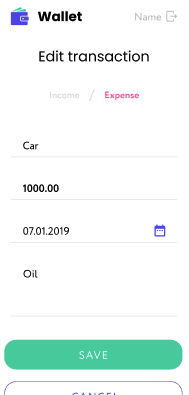
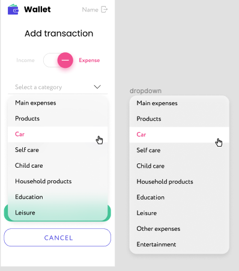
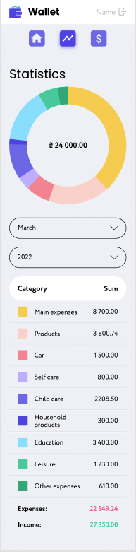

# Wallet App by Hi5 Team 


> Wallet App is a web-based application that allows users to manage their finances, monitor transactions and track account balances. The app is designed for personal use and provides tools for tracking income and expenses.


## Table of Contents
* [General Info](#general-information)
* [Site](#site)
* [Technologies Used](#technologies-used)
* [Features](#features)
* [Setup](#setup)
* [Project Status](#project-status)
* [Acknowledgements](#acknowledgements)
* [Contact](#contact)
* [Documentation pl](#documentation-pl)
* [Documentation en](#documentation-en)


# Site version on Mobile/Tablet/Desktop
## Mobile
### Register Page 

### Login Page

### Balance Page

### Currency Page

### Add Transaction Page Income / Expense


### Edit Transaction Page Income / Expense


### Add Transaction Page Expense 

### Statistics


## Tablet
### Register Page 

### Login Page

### Balance Page

### Currency Page

### Add Transaction Page Income / Expense

### Edit Transaction Page Income / Expense

### Add Transaction Page Expense 

### Statistics

## Desktop

### Register Page 

### Login Page

### Balance Page

### Currency Page

### Add Transaction Page Income / Expense

### Edit Transaction Page Income / Expense

### Add Transaction Page Expense 

### Statistics

## General Information
- The Wallet application created is the final task to take advantage of all the areas faced during the full year of fullstack learning

## Technologies Used
Frontend (client side):
- React.js: JavaScript framework for building the user interface.
- Redux: Library for managing the state of the application.
- React Router: For navigating between different views of the application.
- Formik and Yup: For handling forms and validation.
- Material-UI: For building user interfaces and components.
- Chart.js and react-chartjs-2: For charts and data visualisation.
- React-Loader-Spinner: For displaying the loading indicator (spinner).
- Axios: For making HTTP requests to the server.

Backend (server side):
- Node.js: The runtime environment for the server.
- Express.js: Framework for creating an HTTP server.
- MongoDB: NoSQL database, perhaps using mongoose as the database interaction tool.
- JWT (JSON Web Tokens): For user authentication.
- Swagger UI: For generating API endpoint documentation.

Other:
- CSS: For user interface styling.
- Redux-Persist: For storing the state of the application, including the token in localStorage.
- React-Media: For adapting the interface to different screen resolutions.
- React-Toastify: For displaying error notifications and other messages to the user.
- LocalStorage: For storing certain data on the client side, such as tokens.

## Features
List the ready features here:
- Registration and Login:
- The application handles the registration and login process for users. It uses the Formik and Yup (or Indicative) library to validate form fields, including checking the validity of email address and password length.
- Session Management: After a successful user login, the user's token and credentials are stored in the Redux Store, and the session.isAuth flag is set to true. In case of a login error, the error is stored in the session state and displayed to the user.
- Routing Protection: Higher-Order Components (HOCs) such as withAuthRedirect are used, which control access to specific sites based on the user's authentication status. In this way, routing protection is provided.
- Data Retrieval: The application retrieves transaction and balance status data. These operations are performed when the DashboardPage component is loaded and are asynchronous.
- Displaying Data on Charts: The Chart component uses the react-chartjs-2 library to display data on charts. This data is likely to come from the user's transactions and can be presented as charts.
- Adding Transactions: The app allows you to add new transactions using a form that appears when you click the "Add Transaction" button. Values such as date, amount, transaction type and comment are validated before being sent to the server.
- Transaction Categories: There is an endpoint for obtaining transaction categories, which suggests that transactions can be grouped by category.
- Transaction Statistics: There is an endpoint for obtaining detailed statistics for the month and year with user transactions. This allows you to generate reports and analyze expenses.
- Modal Logout: When the user clicks on the "Logout" button, a modal window appears to confirm the logout. This is an extra layer of security to avoid accidental logout.
- Loader (Spinner): A spinner is used to indicate activity during asynchronous operations, such as downloading data. This spinner is called in the center of the screen.
- Balance Display: The Balance component subscribes to the total balance data and displays it.
- Dynamic Navigation: Navigation between different sections of the app is handled by react-router-dom navigation. Users can navigate between pages, such as "Home" and "Diagram," via the Navigation component.
- Filtering Transactions: The app provides the ability to filter and view transactions to help users keep track of their finances.
- Performance Optimization: There is a suggestion about saving the response with the date of the last request in localStorage and reusing this data for a period of an hour to reduce server load.
- Fonts and Favicon: The app manages fonts and favicon, which affects the look and style of the user interface.
- API documentation: There is a plan to create API endpoint documentation with Swagger UI Express, making it easier to understand and test the API.


## Setup
## For Developers:
# To install all dependencies from package.json use: npm install

## To run front-end App: npm run dev
## To run back-end server.js: npm run start:dev

### Node version: v18.17.1
### npm version: 9.8.0

## Install all packages included in package.json: npm install

Installed packages:
Vite: npm create vite@latest // Use React + Vite / JavaScript + SWC (Speedy Web Compiler)
modern-normalize: npm install modern-normalize
Prettier: npm install --save-dev --save-exact prettier
Redux Toolkit: npm install @reduxjs/toolkit
React-Redux: npm install @reduxjs/toolkit react-redux
redux-persist: npm install redux-persist
react-router-dom: npm install react-router-dom
Firebase: npm install -g firebase-tools
dotenv: npm install dotenv --save
Axios: npm install axios
Mui/material: npm install @mui/material @emotion/react @emotion/styled
Notiflix: npm i notiflix

gh-pages: npm install gh-pages --save-dev

---

Deploying Vite App to GitHub Pages using gh-pages and script deploy:

Install gh-pages: npm install gh-pages --save-dev

Add script in package.json:
"scripts": { "deploy": "npm run build && gh-pages -d dist" },

Run script to build and publish in gh-pages branch on github: 
npm run deploy


## Project status
The project is:completed


## Acknowledgements
- This project as mentioned is the concluding phase of the training - Thanks to Team 5 and Go IT


## Contact
Created by Hi5 Team 
welcome to contact us!

# documentation-pl

# Dokumentacja Wallet App by Hi5 Team


## Spis treści
* [Wstęp](#wstęp)
* [Opis projektu](#opis-projektu)
* [Wersje na różne urządzenia](#wersje-na-różne-urządzenia)
* [Informacje ogólne](#informacje-ogólne)
* [Technologie użyte w projekcie](#technologie-użyte-w-projekcie)
* [Funkcje](#funkcje)
* [Zrzuty ekranu](#zrzuty-ekranu)
* [Instrukcje instalacji i uruchamiania](#instrukcje-instalacji-i-uruchamiania)
* [Status projektu](#status-projektu)
* [Podziękowania](#podziękowania)
* [Kontakt](#kontakt)

## Wstęp

Dokumentacja aplikacji "Wallet App" ma na celu zapewnić pełen obraz projektu, jego funkcji, technologii użytych do jego stworzenia i instrukcji obsługi.

## Opis projektu

Aplikacja "Wallet App" to aplikacja webowa, która umożliwia użytkownikom zarządzanie swoimi finansami, monitorowanie transakcji i śledzenie stanu konta. Aplikacja jest przeznaczona do użytku osobistego i dostarcza narzędzi do śledzenia przychodów i wydatków.

## Wersje na różne urządzenia

Aplikacja "Wallet App" jest dostępna w różnych wersjach, dostosowanych do urządzeń mobilnych, tabletów i komputerów stacjonarnych. Obejmuje to interfejsy użytkownika zoptymalizowane pod kątem różnych rozmiarów ekranów.

## Informacje ogólne

Aplikacja "Wallet App" została stworzona jako projekt końcowy w ramach pełnego roku nauki full-stack development.

## Technologie użyte w projekcie

**Frontend (strona klienta):**
- React.js: Framework JavaScript do budowania interfejsu użytkownika.
- Redux: Biblioteka do zarządzania stanem aplikacji.
- React Router: Do nawigacji między różnymi widokami aplikacji.
- Formik i Yup: Do obsługi formularzy i walidacji.
- Material-UI: Do budowy interfejsów użytkownika i komponentów.
- Chart.js i react-chartjs-2: Do tworzenia wykresów i wizualizacji danych.
- React-Loader-Spinner: Do wyświetlania wskaźnika ładowania (spinnera).
- Axios: Do wykonywania żądań HTTP do serwera.

**Backend (strona serwera):**
- Node.js: Środowisko uruchomieniowe serwera.
- Express.js: Framework do tworzenia serwera HTTP.
- MongoDB: Baza danych NoSQL, być może z użyciem mongoose jako narzędzia do interakcji z bazą danych.
- JWT (JSON Web Tokens): Do uwierzytelniania użytkowników.
- Swagger UI: Do generowania dokumentacji punktów końcowych API.

**Inne:**
- CSS: Do stylizacji interfejsu użytkownika.
- Redux-Persist: Do przechowywania stanu aplikacji, w tym tokenu, w localStorage.
- React-Media: Do dostosowywania interfejsu do różnych rozdzielczości ekranu.
- React-Toastify: Do wyświetlania powiadomień o błędach i innych komunikatów dla użytkownika.
- LocalStorage: Do przechowywania pewnych danych po stronie klienta, takich jak tokeny.

## Funkcje

Poniżej przedstawiamy listę funkcji dostępnych w aplikacji:

**Rejestracja i logowanie:**
- Aplikacja obsługuje proces rejestracji i logowania użytkowników. Do walidacji pól formularzy, w tym sprawdzania poprawności adresu e-mail i długości hasła, wykorzystywana jest biblioteka Formik i Yup (lub Indicative).

**Zarządzanie sesją:**
- Po udanym logowaniu użytkownika, token i dane uwierzytelniające użytkownika są przechowywane w Redux Store, a flaga `session.isAuth` ustawiana jest na `true`. W przypadku błędu logowania, informacja o błędzie jest przechowywana w stanie sesji i wyświetlana użytkownikowi.

**Ochrona routingu:**
- Wykorzystywane są komponenty Higher-Order Components (HOCs), takie jak `withAuthRedirect`, które kontrolują dostęp do konkretnych stron na podstawie stanu uwierzytelnienia użytkownika. W ten sposób zapewniona jest ochrona routingu.

**Pobieranie danych:**
- Aplikacja pobiera dane dotyczące transakcji i stanu konta. Operacje te są wykonywane podczas ładowania komponentu `DashboardPage` i są asynchroniczne.

**Wyświetlanie danych na wykresach:**
- Komponent `Chart` wykorzystuje bibliotekę `react-chartjs-2` do wyświetlania danych na wykresach. Dane te prawdopodobnie pochodzą z transakcji użytkownika i mogą być prezentowane jako wykresy.

**Dodawanie transakcji:**
- Aplikacja pozwala dodawać nowe transakcje za pomocą formularza, który pojawia się po kliknięciu przycisku "Dodaj transakcję". Wartości takie jak data, kwota, typ transakcji i komentarz są walidowane przed wysłaniem ich na serwer.

**Kategorie transakcji:**
- Istnieje punkt końcowy do uzyskiwania kategorii transakcji, co sugeruje, że transakcje można grupować według kategorii.

**Statystyki transakcji:**
- Istnieje punkt końcowy do uzyskiwania szczegółowych statystyk na miesiąc i rok z transakcjami użytkownika. Pozwala to na generowanie raportów i analizę wydatków.

**Wylogowywanie modalne:**
- Po kliknięciu przycisku "Wyloguj" pojawia się okno modalne, które potwierdza wylogowanie. Jest to dodatkowa warstwa zabezpieczeń, która ma zapobiec przypadkowemu wylogowaniu.

**Loader (Spinner):**
- Spinner jest używany do wskazywania aktywności podczas operacji asynchronicznych, takich jak pobieranie danych. Spinner ten jest wyświetlany na środku ekranu.

**Wyświetlanie salda:**
- Komponent `Balance` subskrybuje dane dotyczące całkowitego salda i je wyświetla.

**Dynamiczna nawigacja:**
- Nawigacja między różnymi sekcjami aplikacji jest obsługiwana przez nawigację `react-router-dom`. Użytkownicy mogą nawigować między stronami, takimi jak "Strona główna" i "Diagram", za pomocą komponentu `Navigation`.

**Filtracja transakcji:**
- Aplikacja umożliwia filtrowanie i przeglądanie transakcji, co pomaga użytkownikom śledzić swoje finanse.

**Optymalizacja wydajności:**
- Istnieje sugestia dotycząca zapisywania odpowiedzi z datą ostatniego żądania w `localStorage` i ponownego wykorzystywania tych danych przez okres godziny, aby zmniejszyć obciążenie serwera.

**Czcionki i favicon:**
- Aplikacja zarządza czcionkami i faviconem, co wpływa na wygląd i styl interfejsu użytkownika.

**Dokumentacja API:**
- Planuje się utworzenie dokumentacji punktów końcowych API za pomocą Swagger UI Express, co ułatwi zrozumienie i testowanie API.


## Instrukcje instalacji i uruchamiania

**Dla deweloperów:**

1. Aby zainstalować wszystkie zależności z pliku `package.json`, użyj polecenia: `npm install`

2. Aby uruchomić aplikację frontendową, wykonaj polecenie: `npm run dev`

3. Aby uruchomić serwer backendowy, wykonaj polecenie: `npm run start:dev`

**Wersje Node.js i npm:**
- Wersja Node.js: v18.17.1
- Wersja npm: 9.8.0

**Zainstalowane paczki:**

- Vite: `npm create vite@latest // Użyj React + Vite / JavaScript + SWC (Speedy Web Compiler)`
- modern-normalize: `npm install modern-normalize`
- Prettier: `npm install --save-dev --save-exact prettier`
- Redux Toolkit: `npm install @reduxjs/toolkit`
- React-Redux: `npm install @reduxjs/toolkit react-redux`
- redux-persist: `npm install redux-persist`
- react-router-dom: `npm install react-router-dom`
- Firebase: `npm install -g firebase-tools`
- dotenv: `npm install dotenv --save`
- Axios: `npm install axios`
- Mui/material: `npm install @mui/material @emotion/react @emotion/styled`
- Notiflix: `npm i notiflix`
- gh-pages: `npm install gh-pages --save-dev`

**Wdrożenie aplikacji Vite na GitHub Pages przy użyciu gh-pages:**

1. Zainstaluj `gh-pages` za pomocą polecenia: `npm install gh-pages --save-dev`

2. Dodaj następujący skrypt do pliku `package.json`:

   ```json
   "scripts": {
     "deploy": "npm run build && gh-pages -d dist"
   }


# documentation-EN

# Documentation Wallet App by Hi5 Team


## Table of Contents
* [Introduction](#introduction)
* [Project Description](#project-description)
* [Versions for Different Devices](#versions-for-different-devices)
* [General Information](#general-information)
* [Technologies Used](#technologies-used)
* [Features](#features)
* [Screenshots](#screenshots)
* [Installation and Running Instructions](#installation-and-running-instructions)
* [Project Status](#project-status)
* [Acknowledgments](#acknowledgments)
* [Contact](#contact)

## Introduction

The documentation of the "Wallet App" aims to provide a comprehensive overview of the project, its features, the technologies used in its creation, and user instructions.

## Project Description

The "Wallet App" is a web application that allows users to manage their finances, monitor transactions, and track account balances. The application is intended for personal use and provides tools for tracking income and expenses.

## Versions for Different Devices

The "Wallet App" is available in various versions tailored to mobile devices, tablets, and desktop computers. This includes user interfaces optimized for different screen sizes.

## General Information

The "Wallet App" was created as a final project as part of a full-year full-stack development program.

## Technologies Used

**Frontend (Client-side):**
- React.js: JavaScript framework for building user interfaces.
- Redux: Library for managing the application's state.
- React Router: Used for navigation between different application views.
- Formik and Yup: Handling forms and validation.
- Material-UI: Building user interfaces and components.
- Chart.js and react-chartjs-2: Creating charts and data visualization.
- React-Loader-Spinner: Displaying a loading spinner.
- Axios: Making HTTP requests to the server.

**Backend (Server-side):**
- Node.js: Server runtime environment.
- Express.js: Framework for creating an HTTP server.
- MongoDB: NoSQL database, possibly using mongoose for interacting with the database.
- JWT (JSON Web Tokens): User authentication.
- Swagger UI: Generating API endpoint documentation.

**Others:**
- CSS: Styling the user interface.
- Redux-Persist: Storing the application state, including tokens, in localStorage.
- React-Media: Adapting the interface to different screen resolutions.
- React-Toastify: Displaying error notifications and other messages to users.
- LocalStorage: Storing certain data on the client-side, such as tokens.

## Features

Below is a list of features available in the application:

**Registration and Login:**
- The application supports the user registration and login process. Form field validation, including email address validation and password length checks, is handled using the Formik and Yup (or Indicative) libraries.

**Session Management:**
- Upon successful user login, the user's token and authentication data are stored in the Redux Store, and the `session.isAuth` flag is set to `true`. In case of login errors, error information is stored in the session state and displayed to the user.

**Routing Protection:**
- Higher-Order Components (HOCs), such as `withAuthRedirect`, are used to control access to specific pages based on the user's authentication state. This ensures routing protection.

**Data Retrieval:**
- The application retrieves transaction data and account balances. These operations are performed when the `DashboardPage` component is loaded and are asynchronous.

**Displaying Data on Charts:**
- The `Chart` component uses the `react-chartjs-2` library to display data on charts. This data likely comes from user transactions and can be presented as charts.

**Adding Transactions:**
- The application allows users to add new transactions using a form that appears when the "Add Transaction" button is clicked. Values such as date, amount, transaction type, and comment are validated before being sent to the server.

**Transaction Categories:**
- There is an endpoint for obtaining transaction categories, suggesting that transactions can be grouped by category.

**Transaction Statistics:**
- There is an endpoint for obtaining detailed monthly and yearly statistics on user transactions. This allows for report generation and expense analysis.

**Modal Logout:**
- Clicking the "Logout" button triggers a modal window confirming the logout. This is an additional security layer to prevent accidental logout.

**Loader (Spinner):**
- A spinner is used to indicate activity during asynchronous operations, such as data retrieval. This spinner is displayed in the center of the screen.

**Displaying Balance:**
- The `Balance` component subscribes to total balance data and displays it.

**Dynamic Navigation:**
- Navigation between different sections of the application is handled by `react-router-dom` navigation. Users can navigate between pages such as "Home" and "Chart" using the `Navigation` component.

**Transaction Filtering:**
- The application allows for transaction filtering and browsing, helping users track their finances.

**Performance Optimization:**
- There is a suggestion to save responses with the timestamp of the last request in `localStorage` and reuse this data within an hour to reduce server load.

**Fonts and Favicon:**
- The application manages fonts and the favicon, affecting the appearance and style of the user interface.

**API Documentation:**
- There are plans to create documentation for API endpoints using Swagger UI Express, making it easier to understand and test the API.


## Installation and Running Instructions

**For Developers:**

1. To install all dependencies from the `package.json` file, use the command: `npm install`

2. To run the frontend application, use the command: `npm run dev`

3. To start the backend server, use the command: `npm run start:dev`

**Node.js and npm Versions:**
- Node.js Version: v18.17.1
- npm Version: 9.8.0

**Installed Packages:**

- Vite: `npm create vite@latest // Use React + Vite / JavaScript + SWC (Speedy Web Compiler)`
- modern-normalize: `npm install modern-normalize`
- Prettier: `npm install --save-dev --save-exact prettier`
- Redux Toolkit: `npm install @reduxjs/toolkit`
- React-Redux: `npm install @reduxjs/toolkit react-redux`
- redux-persist: `npm install redux-persist`
- react-router-dom: `npm install react-router-dom`
- Firebase: `npm install -g firebase-tools`
- dotenv: `npm install dotenv --save`
- Axios: `npm install axios`
- Mui/material: `npm install @mui/material @emotion/react @emotion/styled`
- Notiflix: `npm i notiflix`
